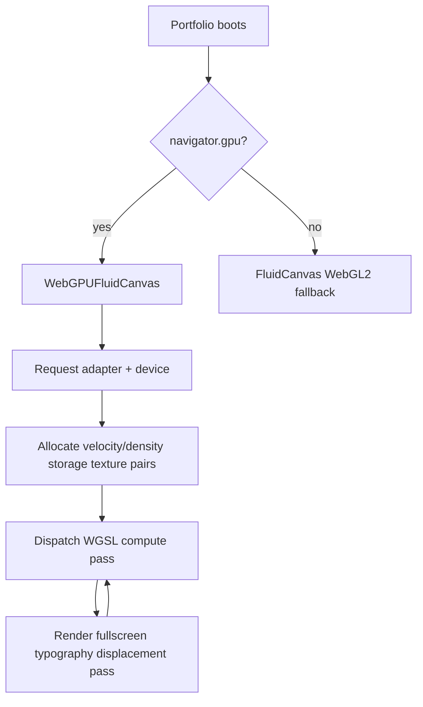

# WebGPU Fluid Architecture

This portfolio currently ships a WebGL2 ping-pong FBO fluid renderer. The next renderer should be WebGPU-first, with the existing WebGL2 renderer as the fallback for browsers without `navigator.gpu`.

## Goals

- Move the simulation from fragment-shader FBO passes to WGSL compute shaders.
- Support larger velocity and density fields for millions of particles or high-resolution ink.
- Use the fluid velocity field to displace a typography texture captured from DOM text.
- Preserve the current WebGL2 renderer as a graceful fallback.

## Runtime Boundary

## Texture Model

Use double-buffered storage textures:

- `velocityA`, `velocityB`: `rgba16float`; velocity in `xy`.
- `densityA`, `densityB`: `rgba16float`; ink/density in `x`.
- `typographyTexture`: DOM text captured through `html-to-image` or a canvas text atlas.

Although the product language says "in place," compute shaders should not read and write the same texture cells in one dispatch. Double-buffering avoids workgroup hazards and remains fast because WebGPU swaps bind groups instead of copying texture contents.

## Per-Frame Pipeline

1. Read mouse position, mouse delta, scroll velocity, viewport size, and time.
2. Update a uniform buffer with simulation params.
3. Dispatch `fluidComputeWGSL` with `ceil(width / 8)` by `ceil(height / 8)` workgroups.
4. Swap velocity and density read/write texture handles.
5. Regenerate the typography texture only when relevant DOM text or viewport bounds change.
6. Run the fullscreen render pass from `textDisplaceWGSL`.
7. If WebGPU initialization fails, mount the existing `FluidCanvas` WebGL fallback.

## Source Files

- `src/components/fluid/webgpu/webgpuFluidShaders.ts`: WGSL compute and render shader strings.
- `src/components/fluid/webgpu/WebGPUFluidCanvas.tsx`: browser feature detection and pipeline shell.
- `src/components/fluid/FluidCanvas.tsx`: current WebGL2 fallback.

## R3F Notes

React Three Fiber can work with an async WebGPU renderer, but Three's WebGPU exports are still experimental. Keep the WebGPU implementation behind a small adapter component so `three/webgpu` changes do not break the rest of the portfolio. The fallback path should remain a normal R3F `<Canvas>` using the current `FluidSimulation`.
